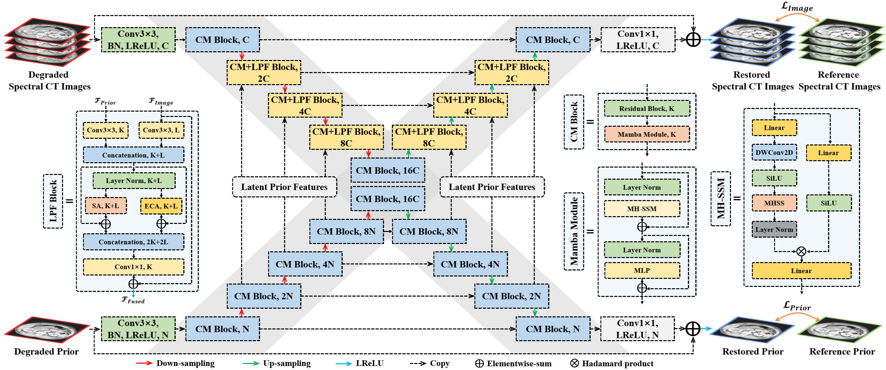
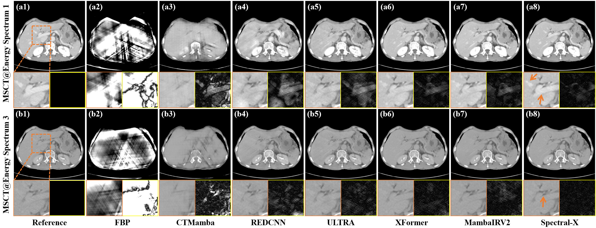

# Spectral-X: Latent Prior Enhanced Spectral CT Restoration with Mamba-assisted X-Net
Yikun Zhang, Jiashun Wang, Xi Wang, et al.


## Abstract
> Compared with conventional computed tomography (CT), spectral CT can simultaneously visualize internal structures and characterize the material composition of scanned objects by acquiring data at different energy spectra. Photon-counting CT (PCCT) and multi-source CT (MSCT) are two promising implementations of spectral CT. Besides, radiation exposure remains a long-standing concern in CT imaging, as excessive X-ray exposure may lead to genetic and cellular damage. For PCCT and MSCT, the radiation dose can be reduced by lowering the tube current and adopting complementary limited-view scanning, respectively. To mitigate the noise and artifacts induced by low-dose acquisition protocols, this paper proposes a Mamba-assisted X-Net leveraging latent priors for spectral CT, termed Spectral-X. First, considering the intrinsic characteristics of spectral CT, Spectral-X exploits the latent representation of the enhanced full-spectrum prior image to facilitate the restoration of multi-energy CT (MECT). Second, Spectral-X employs an X-shaped network with feature fusion blocks to adaptively capture and leverage multi-scale prior information in the latent space. Third, Spectral-X integrates a novel all-around Mamba mechanism that can efficiently model long-range dependencies, thereby enhancing the performance of the image restoration backbone network. Spectral-X is evaluated on both PCCT denoising and limited-view MSCT restoration tasks, and the experimental results demonstrate that Spectral-X achieves state-of-the-art performance in noise suppression, artifact removal, and structural restoration.

## Motivation Diagram
<p align="center">  </p>

## Architecture Diagram
<p align="center">  </p>

## Visual Result @ PCCT Denoising
<p align="center">  </p>

## Visual Result @ Sparse-View MSCT Restoration
<p align="center">  </p>

## Usage
### 1.Environment Setup
```bash
pip install -r requirements.txt
```